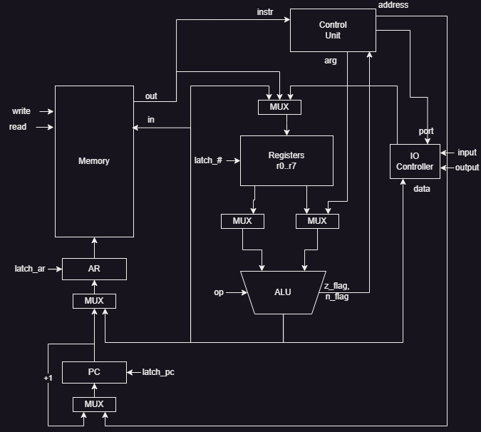
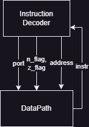

# Лабораторная работа 3 по Архитектуре Компьютера

- ...
- `asm | risc | neum | hw | instr | binary -> struct | trap -> stream | port | cstr | prob2 | spi`
- Упрощенный вариант

## Описание варианта:
- asm -- синтаксис ассемблера. Необходима поддержка label-ов.
- risc -- система команд должна быть упрощенной, в духе RISC архитектур
  - стандартизированная длина команд; 
  - операции над данными осуществляются только в рамках регистров;
  - доступ к памяти и ввод-вывод -- отдельные операции (с учётом специфики вашего варианта mem/port);
- neum -- фон Неймановская архитектура.
- hw -- hardwired. Реализуется как часть модели.
- instr -- процессор необходимо моделировать с точностью до каждой инструкции
- struct -- в виде высокоуровневой структуры данных. Считается, что одна инструкция укладывается в одно машинное слово
- stream - Ввод-вывод осуществляется как поток токенов
- port -- port-mapped (специальные инструкции для ввода-вывода)
- cstr -- Null-terminated (C string)


## Язык программирования

### Описание синтаксиса
```ebnf
<program> ::= { <line> }


<line> ::= [ <label>":" ] (<data_value> | <instruction>) [ <comment> ]

<data_value> ::= | dd { <number>, }
                 | dd { <string>, }
                 | "times" <positive_integer> dd <number>
                 
<instruction> ::= | lw <register> <register>
                  | sw <register> <register>
                  | in <register> <positive_integer>
                  | out <register> <positive_integer>
                  | beq <register> <register> <label>
                  | bge <register> <register> <label>
                  | jmp <label>
                  | add <register> <register> (<register> | <label> | <positive_integer>)
                  | sub <register> <register> (<register> | <label> | <positive_integer>)
                  | mul <register> <register> (<register> | <label> | <positive_integer>)
                  | div <register> <register> (<register> | <label> | <positive_integer>)
                  | hlt

<positive_integer> ::= <any of "0-9">

<register> ::= "r"<positive_integer>

<label> ::= <any of a-Z>

<comment> ::= ;<any letter>

```

### Семантика
- Глобальная видимость данных
- Глобальная видимость меток
- Последовательное исполнение
- Поддерживаются целочисленные литералы
- Точка входа в программу -- метка `_start` (метка не может повторяться или отсутствовать)
- Метки находятся на одной строке с инструкцией
- Любой текст, расположенный в конце строки после символа ; трактуется как комментарий
- Выделение памяти под переменные:
  - С заранее известным значением: `label: dd "Hello, World!", 0`
  - Без заранее известного значения: `label: times 10 dd 0`

## Организация памяти
-  Машинное слово – не определено. Реализуется высокоуровневой структурой данных. Операнд – 32-битный. Интерпретируется
  как беззнаковое целое число. При попытке чтения данных из ячейки с данными исполнение программы аварийно завершится
- Адресация - абсолютная
- Константы отсутствуют, память динамическая
- Программа и данные хранятся в общей памяти согласно архитектуре фон Неймана.
- Программа - набор инструкций. Последняя - HLT
- Операция записи в память перезапишет ячейку памяти как ячейку с данными. Программист имеет доступ на чтение/запись в
  любую ячейку памяти.
- Программисту доступны для взаимодействия 7 регистров общего назначения r1..r7
- Специальный регистр r0 не доступен для записи, в нем всегда содержится ноль
- Команды для операций в АЛУ (ADD, SUB, DIV, MUL) поддерживают указание целочисленного литерала 
в качестве последнего аргумента, который будет непосредственно загружен в АЛУ
- Команды для операций в АЛУ (ADD, SUB, DIV, MUL) поддерживают указание названия метки 
в качестве последнего аргумента, адрес которой будет непосредственно загружен в АЛУ
- Адрес начала программы задается меткой `_start:`

```
  Registers
+------------+
| r0         |
| r1         |
| r2         |
| r3         |
| r4         |
| r5         |
| r6         |
| r7         |
+------------+

       Memory
+--------------------------+
| 00  : jmp N              |
|    ...                   |
| n   : program start      |
|    ...                   |
| i   : program data       |
| i+1 : program data       |
|    ...                   |
+--------------------------+
```

## Система команд

### Особенности процессора:
- Машинное слово не определено
- Память однопортовая
- Доступ к памяти по адресу, содержащимся в AR
- Обращения к устройствам вывода через порты
  - порт 0: устройство вывода
  - порт 1: устройство ввода
- Поток управления:
  - PC инкрементируется после каждой инструкции
  - Условные и безусловные переходы (JMP, BEQ, BGE)

### Набор инструкций:

| Синтаксис | Описание                                   | Аргумент 1           | Аргумент 2 | Аргумент 3          |
|-----------|--------------------------------------------|----------------------|------------|---------------------|
| `lw`      | Загрузить значение из памяти по адресу     | целевой регистр      | адрес      | -                   |
| `sw`      | Сохранить значение в память                | адрес                | значение   |                     |
| `in`      | Прочитать значение из ВУ в регистр         | целевой регистр      | порт       |                     |
| `out`     | Записать значение в ВУ из регистра         | регистр со значением | порт       |                     |
| `beq`     | Переход если аргументы равны               | регистр              | регистр    | метка               |
| `bge`     | Переход если первый регистр больше второго | регистр              | регистр    | метка               |
| `jmp`     | Безусловный переход                        | метка                |            |                     |
| `add`     | Сложить два числа                          | целевой регистр      | регистр    | регистр или литерал |
| `sub`     | Вычесть два числа                          | целевой регистр      | регистр    | регистр или литерал |
| `mul`     | Умножить два числа                         | целевой регистр      | регистр    | регистр или литерал |
| `div`     | Целочисленно разделить два числа           | целевой регистр      | регистр    | регистр или литерал |
| `hlt`     | Завершение работы программы                |                      |            |                     |

### Способ кодирования инструкций

- Машинный код сереализуется в список JSON
- Один элемент списка -- одна инструкция

Пример:
```json
{
  "opcode": "add",
  "args": [
    "r2",
    "r2",
    1
  ]
}
```

## Транслятор
Интерфейс командной строки: `translator.py <input_file> <target_file>`

Реализовано в модуле [translator.py](ak_lab3/translator.py)

Этапы трансляции:
- `preprocess_tokenize` - удаление комментариев, разбиение программы на токены
- `parse_tokens` - преобразование токенов в инструкции и выделение меток с адресами
- `validate_instructions` - проверка корректности количества аргументов у инструкций
- `parse_instruction_args` - преобразование аргументов инструкций (регистры в Enum, литералы в int)
- `map_labels` - маппинг адресов лейблов в аргументах инструкций

Правила трансляции:
- Наличие метки `_start`
- Лейблы и инструкции на одной строке
- Верное количество аргументов у инструкции
- Ссылаться можно только на существующие метки

## Модель процессора
Интерфейс командной строки: `machine.py <machine_code_file> <input_file>`

Реализовано в модуле [machine.py](ak_lab3/machine.py)

### DataPath



Реализован в классе DataPath

`memory` -- однопортовая память, поэтому либо читаем, либо пишем.

Регистры:
 - r0 - регистр содержащий ноль
 - r1..r7 регистры общего назначения
 - pc - счетчик команд
 - ar - адресный регистр

### ControlUnit



Реализован в классе ControlUnit

- Hardwired (реализовано полностью на Python)
- Метод decode_and_execute_instruction моделирует выполнение полного цикла инструкции


Особенности работы модели:

- Цикл симуляции осуществляется в функции simulation
- Шаг моделирования соответствует одной инструкции с выводом состояния в журнал 
(каждая запись в журнале соответсвует состоянию процессора после выполнения инструкции)
- Для журнала состояний процессора используется стандартный модуль logging

## Тестирование
Реализованные программы:

- hello - напечатать hello world
- cat - печатать данные, поданные на вход симулятору через файл ввода (размер ввода потенциально бесконечен)
- hello_user_name - запросить у пользователя его имя, считать его, вывести на экран приветствие
- prob2 - вывести сумму четных чисел последовательности Фиббоначи, не превышающих 4 млн

Интеграционные тесты реализованы в integration_test:
- Стратегия: golden tests, конфигурация в директории [golden](tests/golden)

CI при помощи Github Action:
```yaml
name: Python CI

on:
  push:

defaults:
  run:
    working-directory: ./

jobs:

  test:
    runs-on: ubuntu-latest

    steps:
      - name: Checkout code
        uses: actions/checkout@v4

      - name: Set up Python
        uses: actions/setup-python@v4
        with:
          python-version: "3.11"

      - name: Install dependencies
        run: |
          python -m pip install --upgrade pip
          pip install poetry
          poetry install

      - name: Run tests and collect coverage
        run: |
          poetry run coverage run -m pytest .
          poetry run coverage report -m

  lint:
    runs-on: ubuntu-latest

    steps:
      - name: Checkout code
        uses: actions/checkout@v4

      - name: Set up Python
        uses: actions/setup-python@v4
        with:
          python-version: "3.11"

      - name: Install dependencies
        run: |
          python -m pip install --upgrade pip
          pip install poetry
          poetry install

      - name: Lint code
        run: poetry run pylint . tests

      - name: Check types
        run: poetry run mypy .
```

где:

- poetry - управление зависимостями
- coverage - формирование отчёта об уровне покрытия исходного кода
- pytest - утилита для запуска тестов
- pylint - линтер для проверки соответствия "хорошим практикам" программирования
- mypy - проверка строгой типизации, при наличии

## Пример использования
Пример использования и журнал работы процессора на продемонстрирован на примере hello

```
> python -m ak_lab3.translator .\samples\code\hello.asm .\samples\json\hello.json
> python -m ak_lab3.machine .\samples\json\hello.json .\samples\name
DEBUG:root:TICK:    0 PC:   13 AR:    0 Z_FLAG: 0 N_FLAG: 0     None                                            R1:    0 R2:    0 R3:    0 R4:    0 R5:    0 R6:    0 R7:    0  
DEBUG:root:TICK:    4 PC:   14 AR:   13 Z_FLAG: 1 N_FLAG: 0     {'opcode': 'add', 'args': [R2, R0, 0]}          R1:    0 R2:    0 R3:    0 R4:    0 R5:    0 R6:    0 R7:    0
DEBUG:root:TICK:    9 PC:   15 AR:    0 Z_FLAG: 1 N_FLAG: 0     {'opcode': 'lw', 'args': [R1, R2]}              R1:   72 R2:    0 R3:    0 R4:    0 R5:    0 R6:    0 R7:    0
DEBUG:root:TICK:   13 PC:   16 AR:   15 Z_FLAG: 0 N_FLAG: 1     {'opcode': 'beq', 'args': [R1, R0, 19]}         R1:   72 R2:    0 R3:    0 R4:    0 R5:    0 R6:    0 R7:    0
DEBUG:root:TICK:   17 PC:   17 AR:   16 Z_FLAG: 0 N_FLAG: 1     {'opcode': 'out', 'args': [R1, 0]}              R1:   72 R2:    0 R3:    0 R4:    0 R5:    0 R6:    0 R7:    0
DEBUG:root:TICK:   21 PC:   18 AR:   17 Z_FLAG: 0 N_FLAG: 1     {'opcode': 'add', 'args': [R2, R2, 1]}          R1:   72 R2:    1 R3:    0 R4:    0 R5:    0 R6:    0 R7:    0
DEBUG:root:TICK:   25 PC:   14 AR:   18 Z_FLAG: 0 N_FLAG: 1     {'opcode': 'jmp', 'args': [14]}                 R1:   72 R2:    1 R3:    0 R4:    0 R5:    0 R6:    0 R7:    0
DEBUG:root:TICK:   30 PC:   15 AR:    1 Z_FLAG: 0 N_FLAG: 1     {'opcode': 'lw', 'args': [R1, R2]}              R1:  101 R2:    1 R3:    0 R4:    0 R5:    0 R6:    0 R7:    0
DEBUG:root:TICK:   34 PC:   16 AR:   15 Z_FLAG: 0 N_FLAG: 1     {'opcode': 'beq', 'args': [R1, R0, 19]}         R1:  101 R2:    1 R3:    0 R4:    0 R5:    0 R6:    0 R7:    0
DEBUG:root:TICK:   38 PC:   17 AR:   16 Z_FLAG: 0 N_FLAG: 1     {'opcode': 'out', 'args': [R1, 0]}              R1:  101 R2:    1 R3:    0 R4:    0 R5:    0 R6:    0 R7:    0
DEBUG:root:TICK:   42 PC:   18 AR:   17 Z_FLAG: 0 N_FLAG: 1     {'opcode': 'add', 'args': [R2, R2, 1]}          R1:  101 R2:    2 R3:    0 R4:    0 R5:    0 R6:    0 R7:    0
DEBUG:root:TICK:   46 PC:   14 AR:   18 Z_FLAG: 0 N_FLAG: 1     {'opcode': 'jmp', 'args': [14]}                 R1:  101 R2:    2 R3:    0 R4:    0 R5:    0 R6:    0 R7:    0
DEBUG:root:TICK:   51 PC:   15 AR:    2 Z_FLAG: 0 N_FLAG: 1     {'opcode': 'lw', 'args': [R1, R2]}              R1:  108 R2:    2 R3:    0 R4:    0 R5:    0 R6:    0 R7:    0
DEBUG:root:TICK:   55 PC:   16 AR:   15 Z_FLAG: 0 N_FLAG: 1     {'opcode': 'beq', 'args': [R1, R0, 19]}         R1:  108 R2:    2 R3:    0 R4:    0 R5:    0 R6:    0 R7:    0
DEBUG:root:TICK:   59 PC:   17 AR:   16 Z_FLAG: 0 N_FLAG: 1     {'opcode': 'out', 'args': [R1, 0]}              R1:  108 R2:    2 R3:    0 R4:    0 R5:    0 R6:    0 R7:    0
DEBUG:root:TICK:   63 PC:   18 AR:   17 Z_FLAG: 0 N_FLAG: 1     {'opcode': 'add', 'args': [R2, R2, 1]}          R1:  108 R2:    3 R3:    0 R4:    0 R5:    0 R6:    0 R7:    0
DEBUG:root:TICK:   67 PC:   14 AR:   18 Z_FLAG: 0 N_FLAG: 1     {'opcode': 'jmp', 'args': [14]}                 R1:  108 R2:    3 R3:    0 R4:    0 R5:    0 R6:    0 R7:    0
DEBUG:root:TICK:   72 PC:   15 AR:    3 Z_FLAG: 0 N_FLAG: 1     {'opcode': 'lw', 'args': [R1, R2]}              R1:  108 R2:    3 R3:    0 R4:    0 R5:    0 R6:    0 R7:    0
DEBUG:root:TICK:   76 PC:   16 AR:   15 Z_FLAG: 0 N_FLAG: 1     {'opcode': 'beq', 'args': [R1, R0, 19]}         R1:  108 R2:    3 R3:    0 R4:    0 R5:    0 R6:    0 R7:    0
DEBUG:root:TICK:   80 PC:   17 AR:   16 Z_FLAG: 0 N_FLAG: 1     {'opcode': 'out', 'args': [R1, 0]}              R1:  108 R2:    3 R3:    0 R4:    0 R5:    0 R6:    0 R7:    0
DEBUG:root:TICK:   84 PC:   18 AR:   17 Z_FLAG: 0 N_FLAG: 1     {'opcode': 'add', 'args': [R2, R2, 1]}          R1:  108 R2:    4 R3:    0 R4:    0 R5:    0 R6:    0 R7:    0
DEBUG:root:TICK:   88 PC:   14 AR:   18 Z_FLAG: 0 N_FLAG: 1     {'opcode': 'jmp', 'args': [14]}                 R1:  108 R2:    4 R3:    0 R4:    0 R5:    0 R6:    0 R7:    0
DEBUG:root:TICK:   93 PC:   15 AR:    4 Z_FLAG: 0 N_FLAG: 1     {'opcode': 'lw', 'args': [R1, R2]}              R1:  111 R2:    4 R3:    0 R4:    0 R5:    0 R6:    0 R7:    0
DEBUG:root:TICK:   97 PC:   16 AR:   15 Z_FLAG: 0 N_FLAG: 1     {'opcode': 'beq', 'args': [R1, R0, 19]}         R1:  111 R2:    4 R3:    0 R4:    0 R5:    0 R6:    0 R7:    0
DEBUG:root:TICK:  101 PC:   17 AR:   16 Z_FLAG: 0 N_FLAG: 1     {'opcode': 'out', 'args': [R1, 0]}              R1:  111 R2:    4 R3:    0 R4:    0 R5:    0 R6:    0 R7:    0
DEBUG:root:TICK:  105 PC:   18 AR:   17 Z_FLAG: 0 N_FLAG: 1     {'opcode': 'add', 'args': [R2, R2, 1]}          R1:  111 R2:    5 R3:    0 R4:    0 R5:    0 R6:    0 R7:    0
DEBUG:root:TICK:  109 PC:   14 AR:   18 Z_FLAG: 0 N_FLAG: 1     {'opcode': 'jmp', 'args': [14]}                 R1:  111 R2:    5 R3:    0 R4:    0 R5:    0 R6:    0 R7:    0
DEBUG:root:TICK:  114 PC:   15 AR:    5 Z_FLAG: 0 N_FLAG: 1     {'opcode': 'lw', 'args': [R1, R2]}              R1:   32 R2:    5 R3:    0 R4:    0 R5:    0 R6:    0 R7:    0
DEBUG:root:TICK:  118 PC:   16 AR:   15 Z_FLAG: 0 N_FLAG: 1     {'opcode': 'beq', 'args': [R1, R0, 19]}         R1:   32 R2:    5 R3:    0 R4:    0 R5:    0 R6:    0 R7:    0
DEBUG:root:TICK:  122 PC:   17 AR:   16 Z_FLAG: 0 N_FLAG: 1     {'opcode': 'out', 'args': [R1, 0]}              R1:   32 R2:    5 R3:    0 R4:    0 R5:    0 R6:    0 R7:    0
DEBUG:root:TICK:  126 PC:   18 AR:   17 Z_FLAG: 0 N_FLAG: 1     {'opcode': 'add', 'args': [R2, R2, 1]}          R1:   32 R2:    6 R3:    0 R4:    0 R5:    0 R6:    0 R7:    0
DEBUG:root:TICK:  130 PC:   14 AR:   18 Z_FLAG: 0 N_FLAG: 1     {'opcode': 'jmp', 'args': [14]}                 R1:   32 R2:    6 R3:    0 R4:    0 R5:    0 R6:    0 R7:    0
DEBUG:root:TICK:  135 PC:   15 AR:    6 Z_FLAG: 0 N_FLAG: 1     {'opcode': 'lw', 'args': [R1, R2]}              R1:   87 R2:    6 R3:    0 R4:    0 R5:    0 R6:    0 R7:    0
DEBUG:root:TICK:  139 PC:   16 AR:   15 Z_FLAG: 0 N_FLAG: 1     {'opcode': 'beq', 'args': [R1, R0, 19]}         R1:   87 R2:    6 R3:    0 R4:    0 R5:    0 R6:    0 R7:    0
DEBUG:root:TICK:  143 PC:   17 AR:   16 Z_FLAG: 0 N_FLAG: 1     {'opcode': 'out', 'args': [R1, 0]}              R1:   87 R2:    6 R3:    0 R4:    0 R5:    0 R6:    0 R7:    0
DEBUG:root:TICK:  147 PC:   18 AR:   17 Z_FLAG: 0 N_FLAG: 1     {'opcode': 'add', 'args': [R2, R2, 1]}          R1:   87 R2:    7 R3:    0 R4:    0 R5:    0 R6:    0 R7:    0
DEBUG:root:TICK:  151 PC:   14 AR:   18 Z_FLAG: 0 N_FLAG: 1     {'opcode': 'jmp', 'args': [14]}                 R1:   87 R2:    7 R3:    0 R4:    0 R5:    0 R6:    0 R7:    0
DEBUG:root:TICK:  156 PC:   15 AR:    7 Z_FLAG: 0 N_FLAG: 1     {'opcode': 'lw', 'args': [R1, R2]}              R1:  111 R2:    7 R3:    0 R4:    0 R5:    0 R6:    0 R7:    0
DEBUG:root:TICK:  160 PC:   16 AR:   15 Z_FLAG: 0 N_FLAG: 1     {'opcode': 'beq', 'args': [R1, R0, 19]}         R1:  111 R2:    7 R3:    0 R4:    0 R5:    0 R6:    0 R7:    0
DEBUG:root:TICK:  164 PC:   17 AR:   16 Z_FLAG: 0 N_FLAG: 1     {'opcode': 'out', 'args': [R1, 0]}              R1:  111 R2:    7 R3:    0 R4:    0 R5:    0 R6:    0 R7:    0
DEBUG:root:TICK:  168 PC:   18 AR:   17 Z_FLAG: 0 N_FLAG: 1     {'opcode': 'add', 'args': [R2, R2, 1]}          R1:  111 R2:    8 R3:    0 R4:    0 R5:    0 R6:    0 R7:    0
DEBUG:root:TICK:  172 PC:   14 AR:   18 Z_FLAG: 0 N_FLAG: 1     {'opcode': 'jmp', 'args': [14]}                 R1:  111 R2:    8 R3:    0 R4:    0 R5:    0 R6:    0 R7:    0
DEBUG:root:TICK:  177 PC:   15 AR:    8 Z_FLAG: 0 N_FLAG: 1     {'opcode': 'lw', 'args': [R1, R2]}              R1:  114 R2:    8 R3:    0 R4:    0 R5:    0 R6:    0 R7:    0
DEBUG:root:TICK:  181 PC:   16 AR:   15 Z_FLAG: 0 N_FLAG: 1     {'opcode': 'beq', 'args': [R1, R0, 19]}         R1:  114 R2:    8 R3:    0 R4:    0 R5:    0 R6:    0 R7:    0
DEBUG:root:TICK:  185 PC:   17 AR:   16 Z_FLAG: 0 N_FLAG: 1     {'opcode': 'out', 'args': [R1, 0]}              R1:  114 R2:    8 R3:    0 R4:    0 R5:    0 R6:    0 R7:    0
DEBUG:root:TICK:  189 PC:   18 AR:   17 Z_FLAG: 0 N_FLAG: 1     {'opcode': 'add', 'args': [R2, R2, 1]}          R1:  114 R2:    9 R3:    0 R4:    0 R5:    0 R6:    0 R7:    0
DEBUG:root:TICK:  193 PC:   14 AR:   18 Z_FLAG: 0 N_FLAG: 1     {'opcode': 'jmp', 'args': [14]}                 R1:  114 R2:    9 R3:    0 R4:    0 R5:    0 R6:    0 R7:    0
DEBUG:root:TICK:  198 PC:   15 AR:    9 Z_FLAG: 0 N_FLAG: 1     {'opcode': 'lw', 'args': [R1, R2]}              R1:  108 R2:    9 R3:    0 R4:    0 R5:    0 R6:    0 R7:    0
DEBUG:root:TICK:  202 PC:   16 AR:   15 Z_FLAG: 0 N_FLAG: 1     {'opcode': 'beq', 'args': [R1, R0, 19]}         R1:  108 R2:    9 R3:    0 R4:    0 R5:    0 R6:    0 R7:    0
DEBUG:root:TICK:  206 PC:   17 AR:   16 Z_FLAG: 0 N_FLAG: 1     {'opcode': 'out', 'args': [R1, 0]}              R1:  108 R2:    9 R3:    0 R4:    0 R5:    0 R6:    0 R7:    0
DEBUG:root:TICK:  210 PC:   18 AR:   17 Z_FLAG: 0 N_FLAG: 1     {'opcode': 'add', 'args': [R2, R2, 1]}          R1:  108 R2:   10 R3:    0 R4:    0 R5:    0 R6:    0 R7:    0
DEBUG:root:TICK:  214 PC:   14 AR:   18 Z_FLAG: 0 N_FLAG: 1     {'opcode': 'jmp', 'args': [14]}                 R1:  108 R2:   10 R3:    0 R4:    0 R5:    0 R6:    0 R7:    0
DEBUG:root:TICK:  219 PC:   15 AR:   10 Z_FLAG: 0 N_FLAG: 1     {'opcode': 'lw', 'args': [R1, R2]}              R1:  100 R2:   10 R3:    0 R4:    0 R5:    0 R6:    0 R7:    0
DEBUG:root:TICK:  223 PC:   16 AR:   15 Z_FLAG: 0 N_FLAG: 1     {'opcode': 'beq', 'args': [R1, R0, 19]}         R1:  100 R2:   10 R3:    0 R4:    0 R5:    0 R6:    0 R7:    0
DEBUG:root:TICK:  227 PC:   17 AR:   16 Z_FLAG: 0 N_FLAG: 1     {'opcode': 'out', 'args': [R1, 0]}              R1:  100 R2:   10 R3:    0 R4:    0 R5:    0 R6:    0 R7:    0
DEBUG:root:TICK:  231 PC:   18 AR:   17 Z_FLAG: 0 N_FLAG: 1     {'opcode': 'add', 'args': [R2, R2, 1]}          R1:  100 R2:   11 R3:    0 R4:    0 R5:    0 R6:    0 R7:    0
DEBUG:root:TICK:  235 PC:   14 AR:   18 Z_FLAG: 0 N_FLAG: 1     {'opcode': 'jmp', 'args': [14]}                 R1:  100 R2:   11 R3:    0 R4:    0 R5:    0 R6:    0 R7:    0
DEBUG:root:TICK:  240 PC:   15 AR:   11 Z_FLAG: 0 N_FLAG: 1     {'opcode': 'lw', 'args': [R1, R2]}              R1:   33 R2:   11 R3:    0 R4:    0 R5:    0 R6:    0 R7:    0
DEBUG:root:TICK:  244 PC:   16 AR:   15 Z_FLAG: 0 N_FLAG: 1     {'opcode': 'beq', 'args': [R1, R0, 19]}         R1:   33 R2:   11 R3:    0 R4:    0 R5:    0 R6:    0 R7:    0
DEBUG:root:TICK:  248 PC:   17 AR:   16 Z_FLAG: 0 N_FLAG: 1     {'opcode': 'out', 'args': [R1, 0]}              R1:   33 R2:   11 R3:    0 R4:    0 R5:    0 R6:    0 R7:    0
DEBUG:root:TICK:  252 PC:   18 AR:   17 Z_FLAG: 0 N_FLAG: 1     {'opcode': 'add', 'args': [R2, R2, 1]}          R1:   33 R2:   12 R3:    0 R4:    0 R5:    0 R6:    0 R7:    0
DEBUG:root:TICK:  256 PC:   14 AR:   18 Z_FLAG: 0 N_FLAG: 1     {'opcode': 'jmp', 'args': [14]}                 R1:   33 R2:   12 R3:    0 R4:    0 R5:    0 R6:    0 R7:    0
DEBUG:root:TICK:  261 PC:   15 AR:   12 Z_FLAG: 0 N_FLAG: 1     {'opcode': 'lw', 'args': [R1, R2]}              R1:    0 R2:   12 R3:    0 R4:    0 R5:    0 R6:    0 R7:    0
DEBUG:root:TICK:  266 PC:   19 AR:   15 Z_FLAG: 1 N_FLAG: 0     {'opcode': 'beq', 'args': [R1, R0, 19]}         R1:    0 R2:   12 R3:    0 R4:    0 R5:    0 R6:    0 R7:    0
INFO:root:output buffer: Hello World!
```
